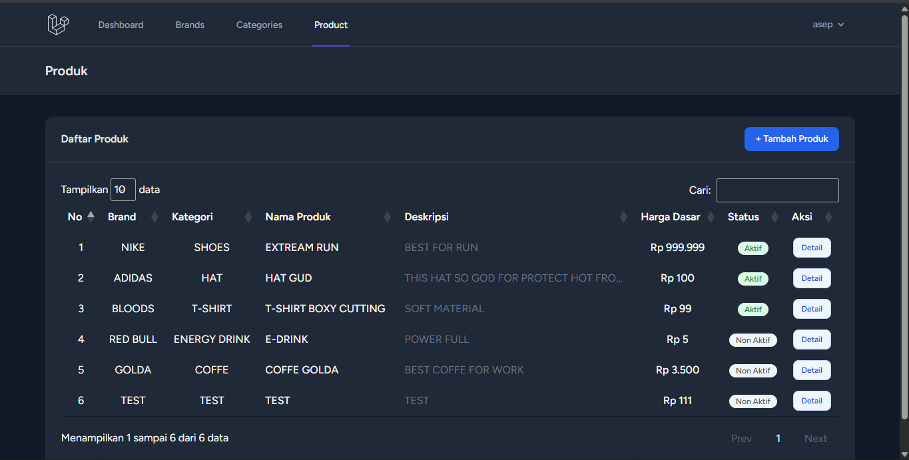
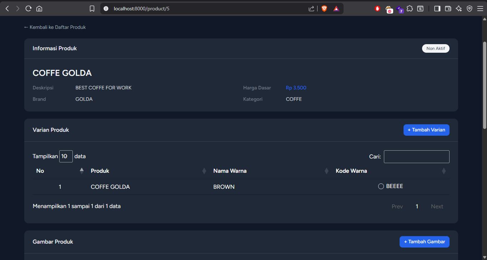

# 🛒 Laravel Ecommerce

Aplikasi ecommerce sederhana berbasis **Laravel 12** yang dibuat sebagai tugas kuliah. Project ini mencakup fitur manajemen produk lengkap dengan variant, ukuran (size), dan gambar produk, dilengkapi sistem autentikasi menggunakan Laravel Breeze.

---

## ✨ Fitur

- **Autentikasi** — Register, login, dan manajemen profil (via Laravel Breeze)
- **Manajemen Produk** — Tambah dan tampilkan daftar produk
- **Variant Produk** — Kelola variant tiap produk (misal: warna)
- **Ukuran Produk** — Kelola size tiap produk (misal: S, M, L, XL)
- **Gambar Produk** — Upload dan tampilkan gambar tiap produk
- **Manajemen Brand & Kategori** — CRUD brand dan kategori produk
- **Stok Variant** — Pencatatan stok per variant
- **Tampilan Modern** — Dibangun dengan Tailwind CSS

---

## 📸 Screenshot

### Halaman Produk


### Detail Produk


---

## 🛠️ Tech Stack

| Teknologi | Keterangan |
|---|---|
| Laravel 12 | PHP Framework |
| PHP ^8.2 | Backend Language |
| Blade | Template Engine |
| Tailwind CSS | CSS Framework |
| MySQL | Database |
| Laravel Breeze | Autentikasi |
| Vite | Asset Bundler |
| Composer | PHP Package Manager |
| NPM | Node Package Manager |

---


## ⚙️ Instalasi & Setup

### Prasyarat
- PHP >= 8.2
- Composer
- Node.js & NPM
- MySQL

### Langkah Instalasi

**1. Clone repository**
```bash
git clone https://github.com/username/laravel-ecommerce.git
cd laravel-ecommerce
```

**2. Install dependensi**
```bash
composer install
npm install
```

**3. Konfigurasi environment**
```bash
cp .env.example .env
php artisan key:generate
```

**4. Konfigurasi database**

Edit file `.env` dan sesuaikan pengaturan database:
```env
DB_CONNECTION=mysql
DB_HOST=127.0.0.1
DB_PORT=3306
DB_DATABASE=nama_database
DB_USERNAME=root
DB_PASSWORD=
```

**5. Jalankan migrasi**
```bash
php artisan migrate
```

**6. Jalankan aplikasi**
```bash
npm run dev
php artisan serve
```

Atau gunakan shortcut dari `composer.json`:
```bash
composer run dev
```

Akses aplikasi di: **http://localhost:8000**

---


## 🧪 Testing

```bash
composer run test
```

---

## 📄 Lisensi

Project ini dibuat untuk keperluan tugas kuliah. Lisensi: [MIT](LICENSE)